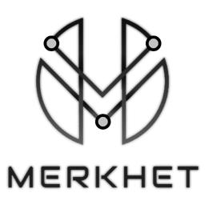

# Merkhet App

Merkhet web-app is an Immersive (WebXR) Analytics toolkit developed under [H2IOSC project](https://www.h2iosc.cnr.it/) as part of task 7.7 (Immersive Analytics).
It is used in conjunction with [Merkhet plugin](https://github.com/phoenixbf/merkhet-plugin) for ATON, specifically dedicated to capture and track users' interactive sesssions.

## Getting started
1) Follow [ATON framework instructions](https://github.com/phoenixbf/aton)

2) Just place (or git clone) app folder in `/Your-ATON-folder/wapps/` thus obtaining: `/Your-ATON-folder/wapps/merkhet/`
3) Open http://localhost:8080/a/merkhet

## Parameters
- s: the scene ID to load
- r: the record to load
